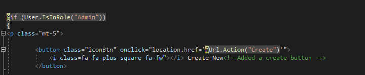
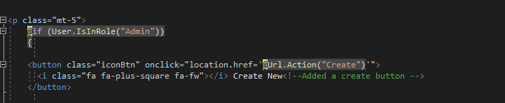
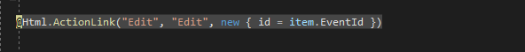
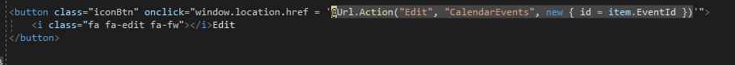
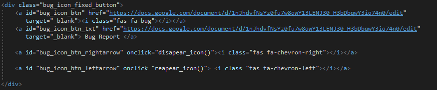
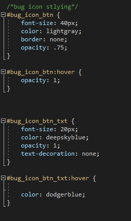
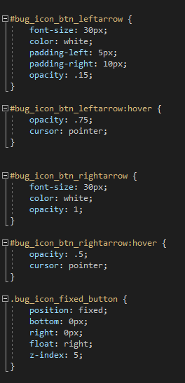
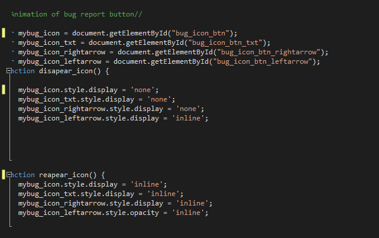
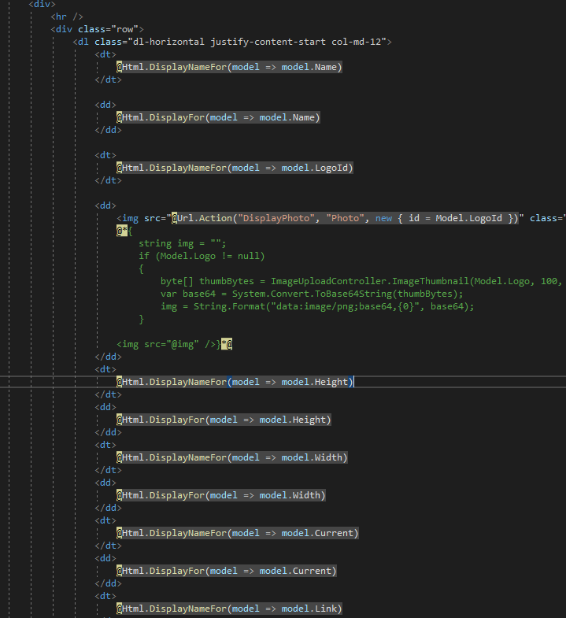
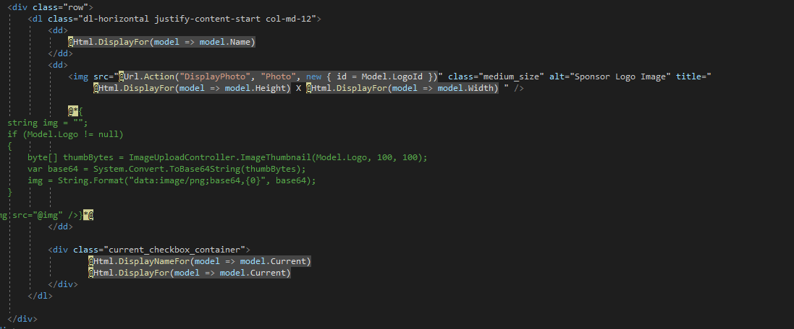

# LiveProject

# Introduction

For the last two weeks, I have worked with a team of developers on a project using ASP .NET MVC and Entity Framework. It’s an interactive website for managing the content and productions for a theater company. Our team split into two groups: C# and Javascript, where the back-end stories were handled by the C# students, while I and a few others built/debugged the front-end. The site had already been built, so a majority of the stories I worked on were either adding features, improving existing functionality, or debugging the code. I worked on several front end stories of varying difficulty and learned a tremendous amount about both project management and the dynamics of working with a development team. 

Here are some of the stories that I worked on, including code snippets and descriptions of my process and some of the challenges I faced:

<h3>Calendar Events Page</h3>

This page has two main pieces: The calendar of upcoming shows for the theater, and a table with links to buy tickets. The issue was that the space between these two elements was only present when the user logged in as an administrator. This was a very simple fix with the following code: 

<h4>Before</h4>

 
<h4>After</h4>

   
Moving the p tag above the conditional “Admin” statement adds the “Create New” and “Bulk Add” buttons for all users. These buttons create the space between the calendar and the table the story asks for. 
 
The second part of the story was to edit the buttons on the table to match the rest of the website. Here is the final edit: 
 
<h4>Before</h4>

 
<h4>After</h4>

 

 
 
<h3>Bug-Report Button</h3>
The purpose of this story was to create a button on the bottom right of every page on the website to report any bugs that the user encounters. The button links to a document where the user can list the bug they found. The button itself uses HTML, CSS, and Javascript. 
 
<h4>HTML</h4>

 
 

 
 
As shown above, the Bug Report button has four separate elements: the bug icon, the text ‘Bug Report’, and right and left chevrons. I made each one of those elements into its own anchor so I could style each element independently. The left/right chevrons call oposite JS functions: the right chevron calls ‘disapear_icon’ which makes both the icon and text disapear and disable. The left chevron calls ‘reapear_icon’ to bring back the button. 
 
<h4>CSS</h4>

 
 

 
 
 
 
 
The elements of the button all have different styling but one commonality is the clickable appearance. Do do this I added a ‘hover’ condition to all the elements, so the color changes slightly and the cursor changes when hovered over that element. I also changed the opacity inside the hover effect so the elements become brighter when hovered. 

<h4>JavaScript</h4>

In this story Javascript is used to define the two functions ‘disapear_icon’ and ‘reappear_icon’. First, I created global variables that will be used in both functions. All the functions are doing is changing certain styling elements of the anchors. One of the roadblocks I hit was that I used the opacity setting to make the button dissapear instead of the display setting. While it did disapear which opacity changed to 0, the anchors were still clickable. The display = none instead removed the anchors so they couldn’t be clicked. 

<h3>Sponsor Delete Page</h3>

<h4>Before</h4>

<h4>After</h4>

The majority of this story was removing, moving, or resizing parts of the page. Above you can see that all that we wanted left was the name of the sponsor, the sponsor logo, and their status as a current sponsor. I also added a title to the image so that when hovering over the logo, the image’s height and width is displayed. One small roadblock I hit on this story was the enlargement of the word ‘Current’ and the checkbox. Originally I placed the text and the box in the same div and increased the font-size. Since the box wasn’t text, only the word ‘Current’ got bigger. Instead I used zoom on the div with both elements to increase the size of both by 1.3x.
